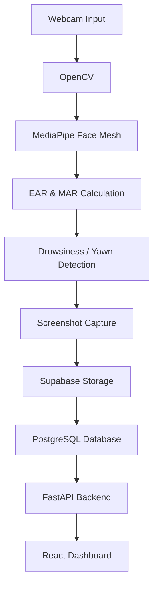

# Driver Monitoring System

An AI-powered Driver Monitoring System that detects driver drowsiness and yawning in real time using Computer Vision. The system captures alert screenshots, stores them in the cloud, logs events in a PostgreSQL database, and provides a web dashboard for monitoring driver activity.

## Live Demo

### Frontend
https://driver-monitoring-system-git-main-yashk57.vercel.app/

### Backend API
https://drivermonitoringsystem-production.up.railway.app/docs

## Features

* Real-time driver monitoring using webcam
* MediaPipe Face Landmark Detection
* Eye Aspect Ratio (EAR) based drowsiness detection
* Mouth Aspect Ratio (MAR) based yawn detection
* Automatic screenshot capture during alert events
* Screenshot upload to Supabase Storage
* PostgreSQL database logging using Supabase
* FastAPI backend with REST APIs
* React dashboard for alert visualization
* Alert history page
* Latest alert preview
* Alert statistics dashboard
* Fully deployed frontend and backend

## Screenshots

### Dashboard


### Alert History


### Detection Window


## Tech Stack

### Backend
* Python
* FastAPI
* OpenCV
* MediaPipe
* PostgreSQL
* Psycopg2

### Frontend
* React
* Vite
* CSS

### Cloud & Deployment
* Supabase Database
* Supabase Storage
* Railway
* Vercel

### Computer Vision
* MediaPipe Face Mesh
* Eye Aspect Ratio (EAR)
* Mouth Aspect Ratio (MAR)

## Project Architecture



## Folder Structure

```text
driver_monitoring_system/
├── app/
│   ├── api.py
│   ├── database.py
│   ├── db_connection.py
│   ├── detection.py
│   ├── main.py
│   ├── storage.py
│   ├── tracking.py
│   └── ...
│
├── frontend/
│   ├── src/
│   ├── public/
│   └── package.json
│
├── screenshots/
├── requirements.txt
└── README.md
```

## Installation

### Clone Repository

```bash
git clone https://github.com/yashkumar57/driver_monitoring_system.git
cd driver_monitoring_system
```

### Backend Setup

```bash
pip install -r requirements.txt
```

### Frontend Setup

```bash
cd frontend
npm install
```

## Running the Project

### Start Backend

```bash
cd app
uvicorn api:app --reload
```

### Start Frontend

```bash
cd frontend
npm run dev
```

## Future Improvements

* Docker Deployment
* AWS Cloud Deployment
* Email Alert System
* Live Dashboard Streaming
* Real-Time Analytics
* Authentication System
* Multi-Driver Support

## Author

**Yash Kumar**
