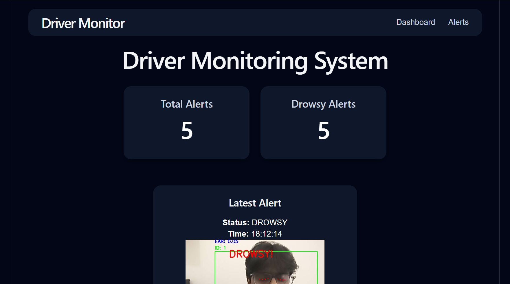
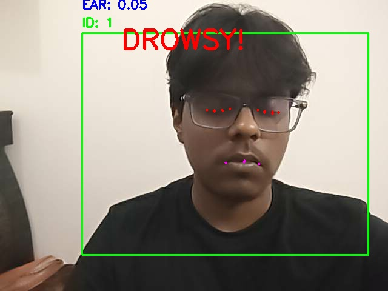

# Driver Monitoring System

An AI-powered Driver Monitoring System that detects driver drowsiness and yawning in real time using Computer Vision and Deep Learning techniques.

## Features

* Real-time driver monitoring using webcam
* YOLOv3-based person detection
* CSRT object tracking
* MediaPipe Face Landmark Detection
* Eye Aspect Ratio (EAR) based drowsiness detection
* Mouth Aspect Ratio (MAR) based yawn detection
* Screenshot capture during alert events
* SQLite database logging
* FastAPI backend with REST APIs
* React dashboard for alert visualization
* Alert history table
* Latest alert preview

## Screenshots

### Dashboard

### Detection Window

## Tech Stack

### Backend
* Python
* OpenCV
* MediaPipe
* FastAPI
* SQLite

### Frontend
* React
* Vite
* CSS

### Computer Vision
* YOLOv3
* CSRT Tracking
* Face Landmark Detection

## Project Architecture

Webcam Input
    ↓
YOLO Person Detection
    ↓
CSRT Tracking
    ↓
MediaPipe Face Landmarks
    ↓
EAR / MAR Calculation
    ↓
Drowsiness & Yawn Detection
    ↓
Screenshot Capture + Database Logging
    ↓
FastAPI Backend
    ↓
React Dashboard

## Folder Structure

driver-monitor/
├── app/
│ ├── main.py
│ ├── api.py
│ ├── detection.py
│ ├── tracking.py
│ ├── alerts.py
│ ├── database.py
│ ├── yolo_detection.py
│ └── yolo/
│
├── frontend/
│ ├── src/
│ ├── public/
│ └── package.json
│
├── screenshots/
└── README.md

## Installation

### Clone Repository
git clone https://github.com/yashkumar57/driver_monitoring_system.git
cd driver_monitoring_system

### Backend Setup
pip install -r requirements.txt

### Frontend Setup
cd frontend
npm install

## Running the Project

## YOLO Weights
The YOLOv3 weights file is not included in this repository due to GitHub file size limitations.
Download:
https://pjreddie.com/media/files/yolov3.weights

Place the file inside:
app/yolo/

### Start Backend
cd app
python -m uvicorn api:app --reload

### Start Frontend
cd frontend
npm run dev

## Future Improvements
* Docker Deployment
* AWS Cloud Deployment
* Live Video Streaming in Dashboard
* Email Alert System
* Real-Time Analytics
* Multi-Driver Support